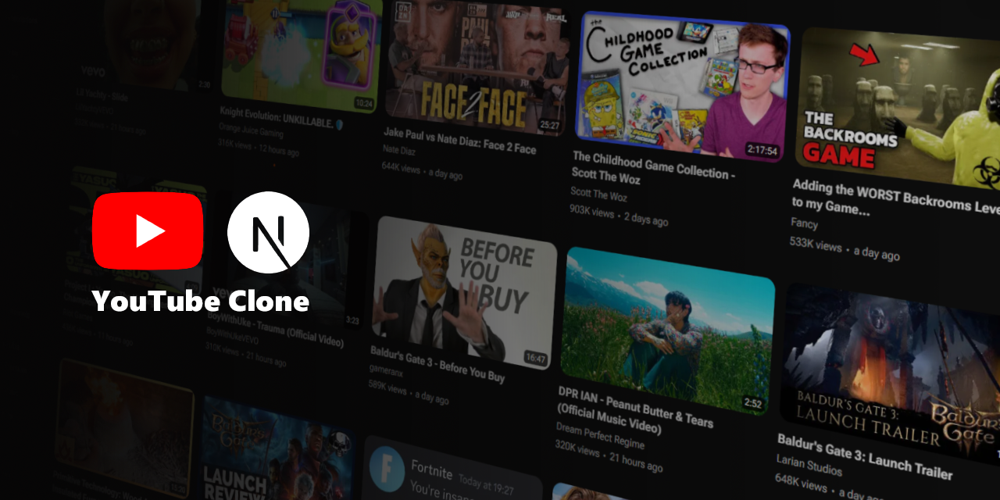

[](https://youtube-next-js.vercel.app)
# [YouTube Clone](https://youtube-next-js.vercel.app/)
<h2>
YouTube web application clone made with Next.js 13, YouTube API v3 and MUI.
</h2>

## 🚀 Live demo
🔗 https://youtube-next-js.vercel.app

## ⌨️ Running locally

```bash
# Clone the repository
git clone https://github.com/m-ler/youtube-clone.git

# Move into the repository
cd youtube-clone

# Install dependencies
npm install
```

Create a .env file with the same variables as [`.env.example`](https://github.com/m-ler/youtube-clone/blob/main/.env.example).

```bash
# Run project
npm run dev
```

## 📌Implemented features

- Home page
- Search results page
- Channel page
- Watch video page
- Dark mode
